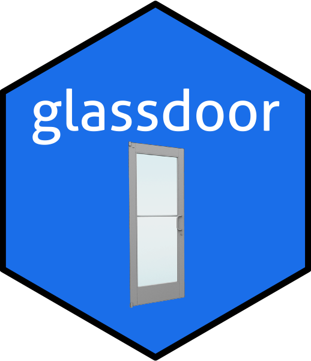

<!-- README.md is generated from README.Rmd. Please edit that file -->

# glassdoor

[](http://jhudatascience.org/)
<br> <!--  -->


The goal of glassdoor is to provide a Glassdoor API for R

[](https://travis-ci.org/muschellij2/glassdoor)
[](https://ci.appveyor.com/project/muschellij2/glassdoor)
[](https://coveralls.io/r/muschellij2/glassdoor?branch=master)
[](https://cran.r-project.org/package=glassdoor)

## Installation

You can install glassdoor from github with:

``` r
# install.packages("devtools")
devtools::install_github("muschellij2/glassdoor")
```

## Glassdoor API Keys

In order to use the `glassdoor` package, you need an API key from
Glassdoor (either
<https://www.glassdoor.com/developer/register_input.htm> or click Get
API key from <https://www.glassdoor.com/developer/index.htm>).

After that is done, you need to set up the API keys. The keys are
grabbed using

``` r
Sys.getenv("GLASSDOOR_PID")
Sys.getenv("GLASSDOOR_PAT")
```

so you can set these either using `~/.Renviron` (will work generally) or
your standard `.profile` or `.bash_profile` (if you work with command
lines).

I recommend `.Renviron` as that works well with RStudio.

Image downloaded from:
<http://resultatdu5eme.com/commercial-glass-door-H31373/commercial-glass-door-r-on-fabulous-commercial-glass-door-26-for-beautiful-home-decorating/>
